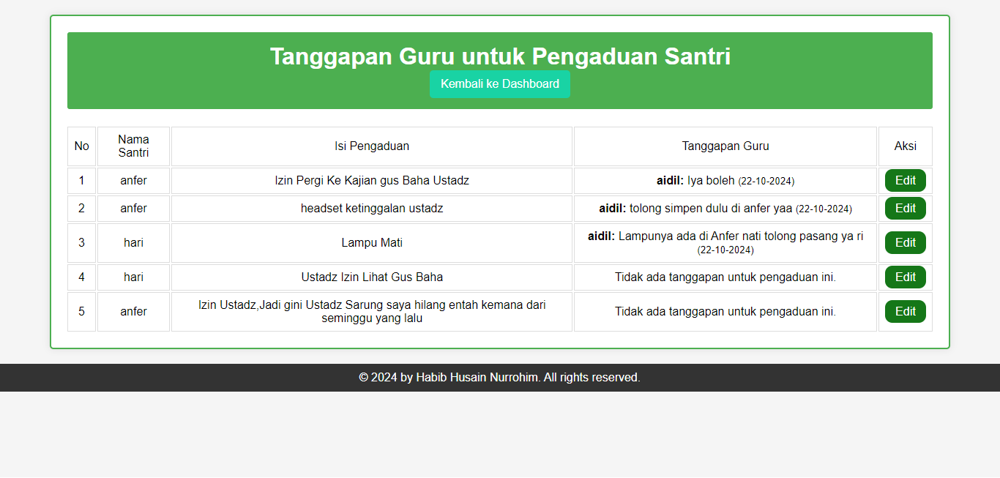

# Kotak Santri

Aplikasi Kotak Santri adalah platform untuk mengelola pengaduan santri. Aplikasi ini memungkinkan santri untuk mengirimkan pengaduan, yang akan ditanggapi oleh guru atau pengelola. Dengan antarmuka yang sederhana dan intuitif, diharapkan dapat meningkatkan komunikasi dan penanganan masalah di lingkungan pesantren.

## Fitur

- **Login Santri dan Guru**: Fasilitas login untuk santri dan guru.

- **Pengaduan**: Santri dapat mengajukan pengaduan dengan menyertakan foto.

- **Tanggapan**: Guru dapat memberikan tanggapan atas pengaduan yang diajukan.

- **Dashboard**: Masing-masing pengguna memiliki dashboard untuk melihat pengaduan dan tanggapan yang relevan.

- **Pengelolaan Santri**: Guru dapat menambah santri baru melalui dashboard.

## Teknologi yang Digunakan

- **Bahasa Pemrograman**: PHP
- **Database**: MySQL
- **CSS**: Untuk styling antarmuka pengguna.

#
## Cara Menjalankan Aplikasi

1. **Persiapan Database**:
   - Buat database baru di MySQL dan import file SQL yang diperlukan untuk membuat tabel `santri`, `guru`, `pengaduan`, dan `tanggapan`.

2. **Konfigurasi**:
   - Sesuaikan file `config/config.php` dengan informasi koneksi database Anda.

3. **Menjalankan Aplikasi**:
   - Buka `index.php` di browser untuk memulai aplikasi.
   - Login sebagai santri atau guru untuk mengakses fitur-fitur yang tersedia.

## Kontribusi

Jika Anda ingin berkontribusi pada proyek ini, silakan fork repository ini dan buat pull request dengan penjelasan perubahan yang Anda lakukan.

## Lisensi

Proyek ini dilisensikan di bawah MIT License. Lihat [LICENSE](LICENSE) untuk lebih detail.

## Penulis

Proyek ini dibuat oleh **Habib Husain Nurrohim**.

---

**Catatan**: Pastikan untuk mengikuti praktik terbaik dalam pengkodean dan pengelolaan database untuk memastikan keamanan dan performa aplikasi.

